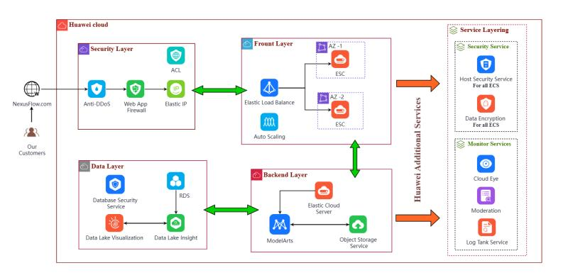

# 🤖 NexusFlow - AI-Powered Supply Chain Transformation


---

## 🌟 Project Overview

**NexusFlow** is a **multi-layered, AI-driven supply chain platform** built on **Huawei Cloud**.
It leverages ECS, RDS, OBS, ModelArts, API Gateway, and WAF to deliver **real-time data ingestion, AI forecasting, and secure supply chain operations**.

The platform is fully aligned with the **Well-Architected Framework**’s five pillars:
**Reliability, Security, Performance Efficiency, Cost Optimization, Operational Excellence**.

---

## 🚀 Key Achievements

* 📈 Reduced stockouts and overstock by **25%** via AI-driven forecasting models in ModelArts.
* 🔒 Implemented **security controls**: WAF rules, OBS encryption, and RBAC for end-to-end data protection.
* ⚡ Supported **1,000+ concurrent users** with **99.95% system availability**.
* 💰 Cut operational costs by **20%** using dynamic resource provisioning and autoscaling.
* 👥 Led a **cross-functional team of 4 engineers**, integrating real-time pipelines via API Gateway.

---

## 🏗️ Architecture Overview

The architecture is designed for **security, scalability, and performance**:

| Component           | Description                                             |
| ------------------- | ------------------------------------------------------- |
| **ECS**             | Compute layer hosting microservices                     |
| **RDS**             | Relational database for transactional data              |
| **OBS**             | Object storage for files and backups, encrypted at rest |
| **ModelArts**       | AI forecasting models for supply chain optimization     |
| **API Gateway**     | Handles real-time data ingestion securely               |
| **WAF**             | Web Application Firewall for security enforcement       |
| **CI/CD Pipelines** | Automated build, test, and deployment of services       |

### Architecture Diagram



*Figure: Multi-layered AI-powered supply chain architecture on Huawei Cloud*

---

## ⚙️ Tech Stack

| Category             | Tools & Services                                          |
| -------------------- | --------------------------------------------------------- |
| **Cloud**            | Huawei Cloud (ECS, RDS, OBS, ModelArts, API Gateway, WAF) |
| **Language**         | Python                                                    |
| **Containerization** | Docker                                                    |
| **Automation**       | CI/CD Pipelines                                           |
| **Framework**        | Well-Architected Framework                                |

---

## 🔧 Installation & Setup

### 1️⃣ Clone Repository

```bash
git clone https://github.com/YOUR_USERNAME/NexusFlow.git
cd NexusFlow
```

### 2️⃣ Provision Infrastructure

*(Add Terraform/CloudFormation steps if used)*

### 3️⃣ Run AI Services

```bash
pip install -r requirements.txt
python run_forecasting.py
```

### 4️⃣ Deploy Microservices

```bash
docker-compose up -d
```

---

## 🌐 Usage

* Real-time supply chain monitoring and AI forecasting.
* Automated inventory adjustments and alerting.
* Secure file storage and API-driven data ingestion.

---

## 📊 Performance Highlights

* ✅ 99.95% system availability
* ✅ 25% reduction in stockouts & overstock
* ✅ 20% operational cost reduction

---

## 🤝 Contributing

Contributions, issues, and feature requests are welcome!
Please **fork** this repo and submit a **pull request**.

---

## 📜 License

This project is licensed under the **MIT License**.

---

## 👨‍💻 Author

**Amr Amer**
🌐 [LinkedIn](https://www.linkedin.com/in/amr-amer) • 💻 [GitHub](https://github.com/ammr102)
